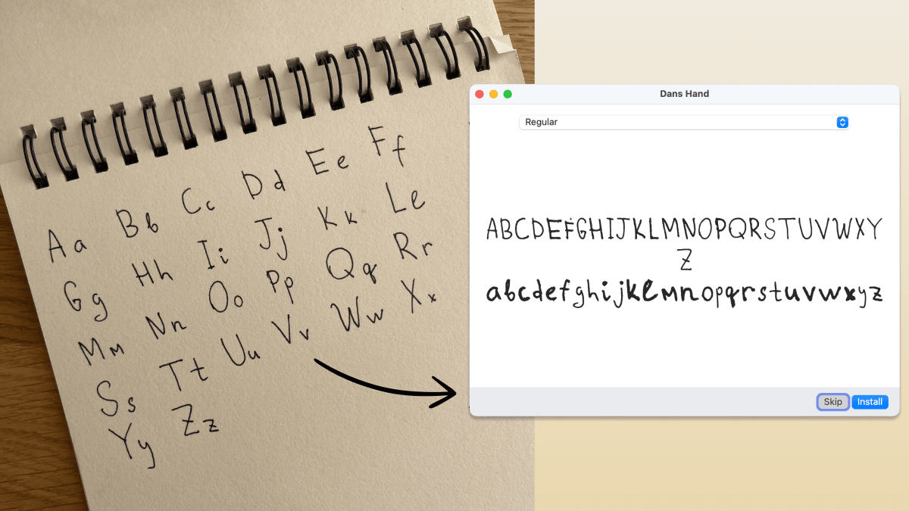

# draw-your-font

**Turn a photo of your handwriting into a real font (TTF/WOFF/WOFF2) - free, open source, no uploads, no credits.**

Draw your alphabet on paper. Take a photo. Get your font.



*This is a real one-shot result: dim light, spiral binding, page shadow - one photo in, installable font out.*

## Use it as a Claude Code skill (the fun way)

```bash
npx skills add danilo-znamerovszkij/draw-your-font
```

Then in Claude Code, just talk:

> *"here's a photo of my handwriting - make my font"* (drag the photo into the terminal)

Claude finds your letters in the photo, labels them with vision, builds the
font, shows you a preview, and critiques its own work. Iterate by talking:

- *"make it rounder"* / *"a bit bolder"*
- *"the g looks bad"* - it shows you the crop and fixes or asks for a re-shoot
- *"give me woff2 + css for my website"*
- *"how readable is it?"* - honest legibility report with concrete fixes

No photo yet? Say *"give me a font template"* - you get a printable PDF grid,
write your alphabet with a dark pen, photograph the pages, and hand them back.
Messy freeform photos work too (napkins, notebooks, spiral binding and bad
lighting included - that's what the vision step is for).

Everything runs locally on your machine. Your handwriting never leaves it.

## Use it as a CLI (no AI at all)

The skill is a thin layer over a deterministic npm CLI - fully usable on its
own when you can tell it what you wrote:

```bash
# freeform photo, you know the order you wrote in:
npx draw-your-font make photo.jpg --chars "ABCabc" --name "My Hand"
# → MyHand.ttf - double-click, install, done.

# best quality: print a template, fill it, photograph:
npx draw-your-font template -o template.pdf --charset minimal   # or: spanish
npx draw-your-font make page1.jpg page2.jpg --charset minimal --name "My Hand"
```

Pure npm, zero system dependencies - no FontForge, no ImageMagick, no potrace
binary. Works on macOS / Linux / Windows wherever Node ≥ 18 runs.

### CLI reference

| Command | What it does |
|---|---|
| `template` | printable A4 PDF grid (`--charset minimal\|spanish`) |
| `segment <photos…>` | find letters → crops + numbered contact sheet + `blobs.json` |
| `build` | labeled crops → font (`--labels` / `--chars` / `--charset`) |
| `make <photos…>` | segment + build in one shot |
| `preview` | render any text with the built font |

Refinement flags: `--smooth 0..2` (rounder curves), `--weight=-2..2`
(thinner/bolder), `--formats ttf,woff,woff2,css` (web-ready + `@font-face`
snippet). Run `draw-your-font --help` for everything.

## How it works

```
photo ──► adaptive threshold ──► blob detection ──► label (Claude / you / template order)
      ──► potrace vectorize ──► shared em-square metrics ──► TTF/WOFF/WOFF2 + preview
```

The craft is in the metrics step: every character has a vertical band in a
shared 1000-unit em square (cap height, x-height, descender depth), so your
`g` hangs below the line and your `o` stays small - that's what makes it feel
like a font instead of a ransom note. Vectorization is potrace, the same
engine inside FontForge and Inkscape. AI never draws your letters; it only
finds, labels, and judges them.

## FAQ

**Who owns the font?** You. 100%, commercial use included. It's your
handwriting.

**Why is this free when Calligraphr charges $8/month?** Their cost is
servers and a browser editor. Here your machine does the work and the agent
is the editor.

**Kerning, ligatures, letter randomization?** v2. The pipeline (fonttools
`calt`) is planned; the current output is a clean single-variant font.

## License

MIT. Draw something.
